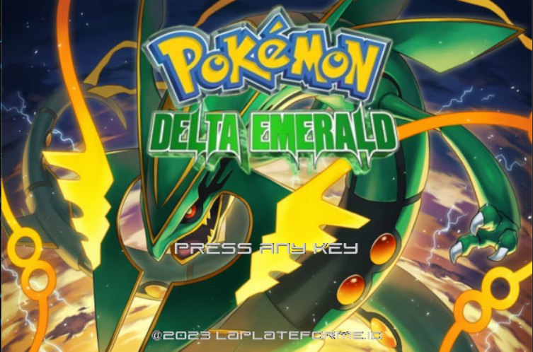
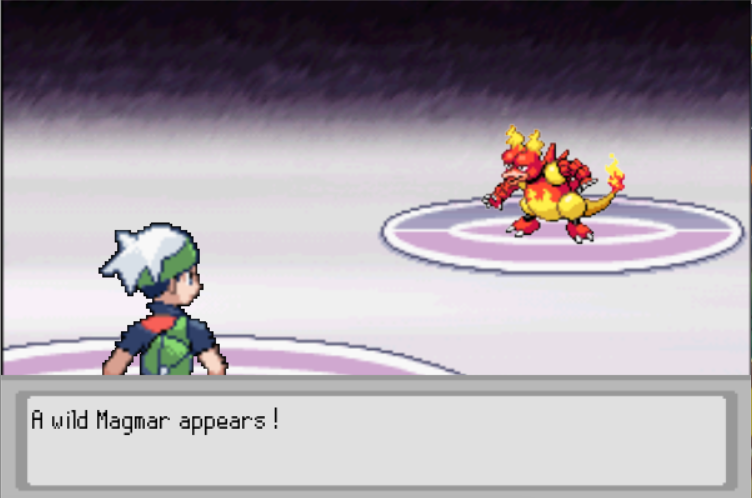

# <p align="center">**POKEMON Delta Emerald**</p>


### __Requirements__


- Python 3.x
- Pygame
<br></br>


### Installation

- git clone
```
git clone https://github.com/pelayo-joel/tetris.git
```


- install pygame
```
pip install pygame
```

<br></br>


## <p align="center">**Presentation**</p>
---
<div align="center">
</div>
<br></br>

<p align="center">A small recreation of Pokemon Emerald with the Pygame module. The game is still in development, stay tuned for more updates...</p>
<br></br>

### **Details**
- The game still being in development, the project is stored in the Pokemon-Project folder. The ``BattlePrototype.py`` script is the same as the ``job05.py`` in the runtrack-python-poo repo in my profile, this was done to get something reviewed:
<br></br>

    - ``Game.py`` is the main file to run.

    - ``Pokemon.py`` contains (for now) two classes classes that handles the game main states (being the TitleScreen or the Game itself).


    - ``PokeObj.py``  holds the different objects related to Pokemon (Pokemon, Map, Player and potentially more).

    - ``widgets.py`` is a file containing pygame based object that i also use for other pygame projects as well, it may change depending on my needs on certain projects (Frame, Spritsheet, ImageAnimation, WindowBox, TextLabel, Button/GfxButton, Slider, GridMap).

    - ``const.py`` contains all the different constant that i use through all other files for this project, especially for all the jsons that are used.

<br></br>

- There are several jsons file to handle all data needed for the game, stored in different folders inside the DATA folder.
<br></br>

    - ``BattleData`` stores the TypeChart (to determine effective, non-effective, ...), all Moves and Items.

    - ``MapsData`` stores TileMap data.

    - ``PlayerData`` stores the players data for potential saves.

    - ``PokemonData`` stores all Pokemons data as well as their natures and their descriptions for the Pokedex.


### **CREDITS** 

- [Pelayo Joel](https://github.com/pelayo-joel)
- [The Spriters ressource](https://www.spriters-resource.com/) for Pokemon Emerald sprites and SFXs
- NINTENDO
